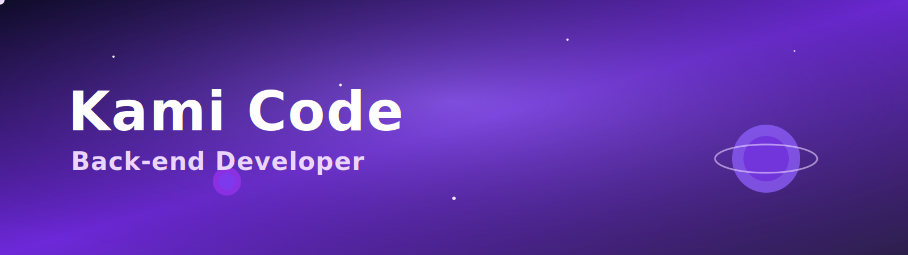

🌐 Available in:  

<!-- Banner -->

  

# 👋 Hi, I’m *Kami Code*

🚀 Junior Back-end Developer • Creator of the **KamiFlow** project  
💜 Turning logic into creative solutions!  

---

## ✨ About Me
- 🎯 Focus on Back-end *(Python, Node.js, SQL)*  
- 📚 Currently learning: *NestJS APIs, Clean Code, Soft Skills for Devs*  
- 🤖 Creator of the **KamiFlow** project (personal automation bot with Python + API)  
- 🎓 Future Software Engineering student  
- 🌍 Languages: Portuguese (native) • English (B1) • Spanish (B1)  
- 💡 Goal: to land my **first Junior Developer position** in tech  

---

## 🛠️ Technologies & Tools

  
  
  
  
  
  
  
  
  
  

 

---

## 🚀 Featured Project
### [KamiFlow](#)  
🤖 Personal automation bot built with **Python + API**  
💜 Focused on productivity and customization  

📌 [Preview the Project](#)  

---

## 📊 My GitHub Stats

  
  

 

---

## 🌍 Where to Find Me

  
  

 

---

## 🚀 My Journeys
Here I keep track of my courses, learnings, and growth as a developer.  
Click the card below to explore my **Learning Journey** 👇  

  

  

---

⭐ Made with 💜 and a lot of ☕ by **Kami Code**

