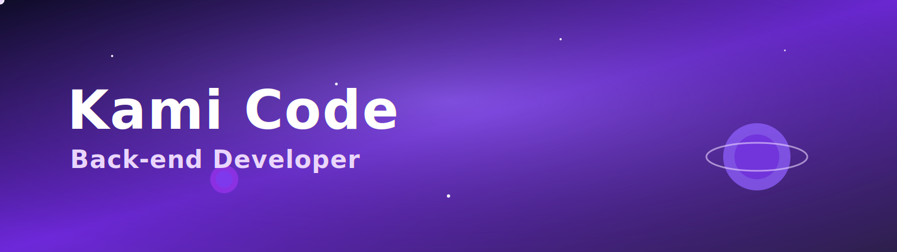

<!-- Banner -->

  

---

# 👋 Olá, eu sou a *Kami Code*  
🚀 Desenvolvedora *Back-end Júnior* • Criadora do projeto *KamiFlow*  
💜 Transformando lógica em soluções criativas!

---

## ✨ Sobre mim
- 🎯 Foco em *Back-end (Python, Node.js, SQL)*  
- 📚 Estudando: *APIs com NestJS, *Clean Code, Soft Skills para Devs  
- 🤖 Criadora do projeto *KamiFlow* (bot de automação pessoal com Python + API)  
- 🎓 Futura estudante de Engenharia de Software  
- 🌍 Idiomas: *Português (nativo)* • *Inglês (B1)* • *Espanhol (B1)*  
- 💡 Objetivo: *conquistar minha primeira vaga júnior em tecnologia*

---

## 🛠 Tecnologias & Ferramentas

  
  
  
  
  
  
  
  
  
  

---

## 🚀 Projetos em Destaque

### 🔹 [KamiFlow](https://github.com/kamicode25dev-hub/kamiflow)  
> 🤖 Bot de automação pessoal desenvolvido em *Python + API*.  
> 💜 Projeto com foco em produtividade e personalização.  

---

## 📊 Minhas Estatísticas no GitHub

  
  

---

## 🌍 Onde me encontrar

  
  

---

## 🚀 Minhas Jornadas

Aqui está o repositório onde registro meus cursos, aprendizados e evolução como desenvolvedora.  
Clique no card abaixo para explorar minha *Learning Journey* 👇

  

---

⭐ Feito com 💜 e muito ☕ por *Kami Code*

